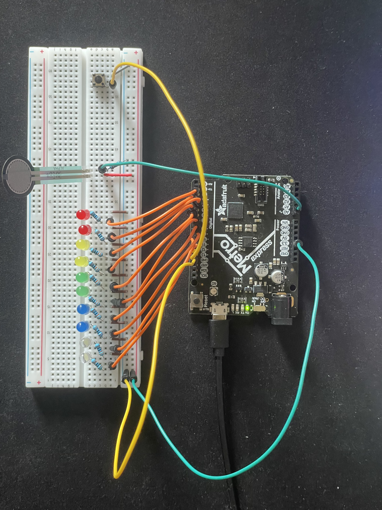

# Force Sensor with LED Output

A CircuitPython project developed on an Adafruit Metro board to measure grip strength using a force sensor. LEDs light up based on force thresholds, and results are compared against prior sessions.

## Features
- Button-activated squeeze test
- Force sensor input processed with CircuitPython
- LEDs display strength level
- Best result stored in memory and displayed

- **Two-test comparison**: 
  - First test records baseline grip strength
  - Second test measures again and compares results
  - If the second test is stronger, all LEDs light up to indicate improvement
- Stores the stronger result in memory for reference

## Tools & Technologies
- CircuitPython
- Adafruit Metro M4 board
- LEDs & force sensor

## How to Run
1. Connect the Metro board via USB.
2. Copy the code file (`code.py`) to the board.
3. Press the button to start a test and squeeze the force sensor.

## Apparatus
  
